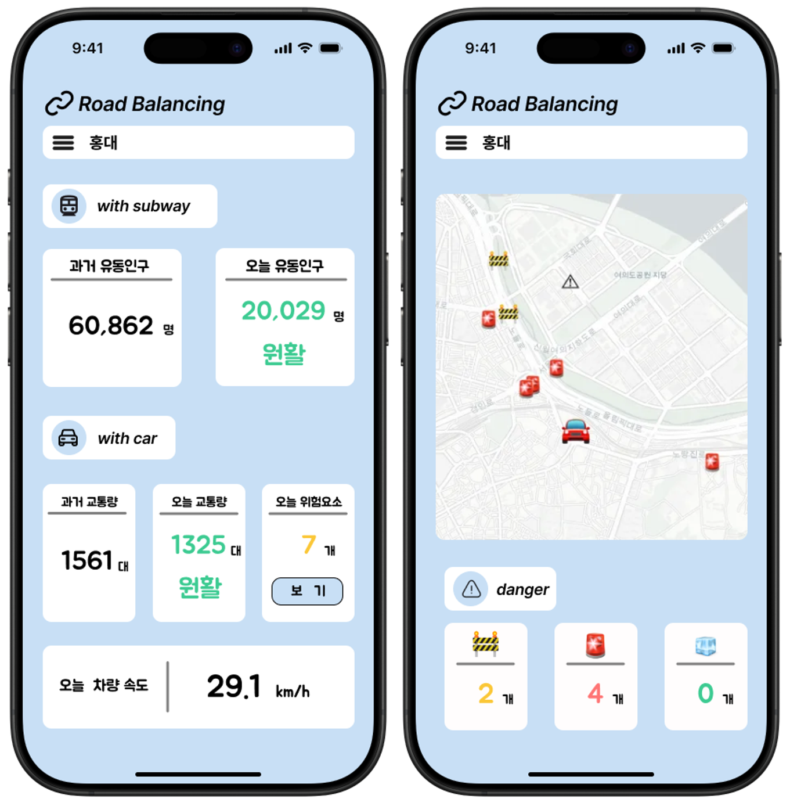
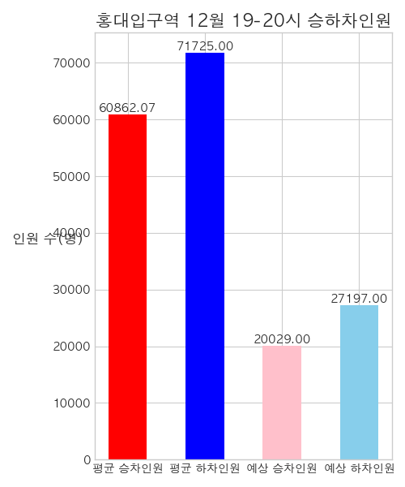
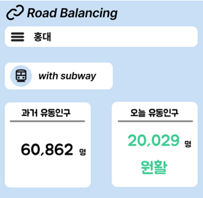
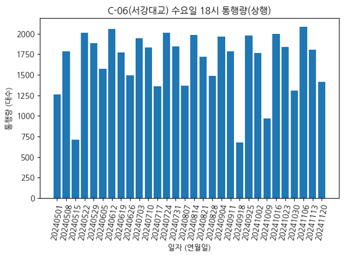
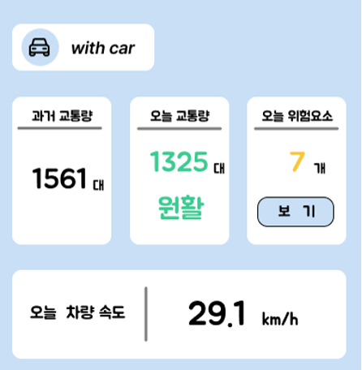
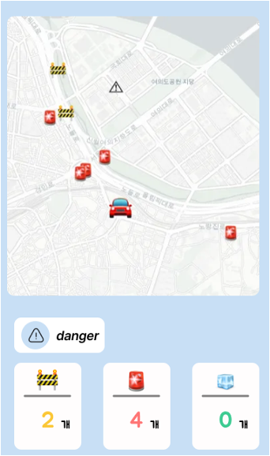

# Road-Balancing

* **ITS infra data를 활용한 교통 의사결정 도우미 플랫폼**
* User Interface : Mobile App (구상)

## Purpose

* ITS 인프라를 통해 얻은 데이터를 활용하여 대중교통, 도로 혼잡도를 확인하고 이에 더해 도로 상황을 실시간으로 확인하여 목적지 이동 시 서비스 이용자의 의사 결정을 도와주는 플랫폼 구성

## 사용 dataset & API

 * 이형섭
   * 사용 데이터셋 & API : https://data.seoul.go.kr/dataList/OA-12252/S/1/datasetView.do
   * 구현 : 과거 지하철 역의 유동인구 분석으로 오늘의 예측 혼잡도를 확인
   * 예시 데이터 : 
     * 입력 : {month : 12, station : '홍대입구', eta : '19'}
     * 결과 :  
     
    
 * 김민수
   * 사용 데이터셋 & API : https://www.data.go.kr/data/15058364/openapi.do?recommendDataYn=Y
   * 구현 : 과거 교통량 분석으로 오늘의 예측 교통량 제공 및 실시간 속도 제공
   * 예시 데이터 : 
     * 입력 : {month : 12, location : '서강대교', eta : '18'}
     * 결과 :  
 * 이지호
   * 사용 데이터셋 & API : https://www.its.go.kr/opendata/opendataList?service=event
   * 구현 : 목적지 주위 실시간 도로 돌발 정보 제공
   * 예시 데이터 : 
     * 입력 : 사용자 현위치(위도 : X, 경도 : Y)
     * 결과 :  사용자 현위치 근방 1km 이내에 돌발 교통 정보 시각화

## 필요성

1. 교통 혼잡 문제 완화
도심 및 주요 도로의 교통량 증가로 인해 발생하는 혼잡은 경제적 손실과 환경 오염을 유발합니다. 
 이를 해결하기 위해서는 실시간 교통 데이터를 기반으로 효율적인 도로 이용을 유도할 수 있는 체계가 필요합니다.
2. 대중교통 이용 활성화
대중교통 수단은 환경 친화적이고 경제적이지만, 이용자들에게 실시간 혼잡도 정보나 대체 경로 정보를 제공하지 못해 매력도가 낮아지는 경우가 많습니다. 
 이를 보완할 수 있는 정보 제공이 요구됩니다.
3. 정확한 교통 정보 제공
기존 교통 정보는 제한적이며, 정적인 데이터만 제공되는 경우가 많아 예측이 어렵습니다. 
 ITS(지능형 교통 시스템) 인프라를 통해 수집된 데이터를 활용하면 실시간으로 정확한 정보를 제공할 수 있습니다.
4. 개인화된 경로 안내 필요
이동 목적과 상황에 따라 최적의 경로가 다르기 때문에, 사용자 맞춤형 경로 추천 및 대안 제공이 필요합니다. 
 예를 들어, 시간 절약이 중요한 사용자와 비용 절감이 중요한 사용자가 요구하는 경로는 다를 수 있습니다.
5. 환경 및 에너지 절감 효과
교통 흐름 최적화 및 대중교통 이용 증대는 연료 소비 감소와 탄소 배출 저감으로 이어져 환경 보호에 기여할 수 있습니다.
1. 재난 및 긴급 상황 대처
사고, 도로 공사, 자연재해 등으로 인해 교통 상황이 급격히 변하는 경우 실시간 데이터 기반의 의사결정 플랫폼은 빠르고 효율적인 대처를 가능하게 합니다.

